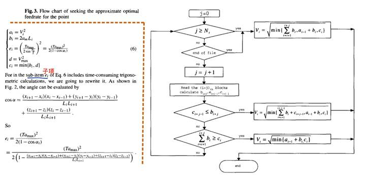
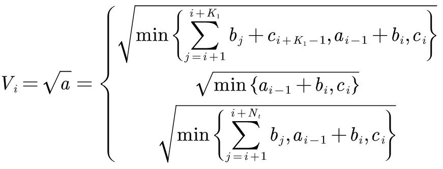

## 五轴CNC的三轴小线段速度规划和插补

[TOC]

---

### 项目说明：

参照论文《An optimal feedrate model and solution algorithm for a high-speed machine of small line blocks with look-ahead 》给出的方法给五轴机床做速度规划。输入原始的刀心数据(x,y,z,i,j,k)，对其进行速度规划和插补，获得插补后的数据(x,y,z,i,j,k)，然后通过运动学逆解转化成刀轴数据(x,y,z,b,c)。通过差分计算实际的速度和加速度与规划的速度进行对比，最后观察平滑滤波后的实际加速度。

采用Python语言编写实验代码

首先进行速度规划，按照如上的流程图对刀心的速度进行规划，计算得到每个刀心点对应的$V_i$，具体的计算过程是先设定前瞻数，这里设定为4，然后通过判断上述循环条件，在

公式中选取对应的值作为当前的$V_i$

---

### 库依赖：

>numpy库
>
>sympy库
>
>matplotlib库

---

### 文件说明：

1.主程序为main.py，在满足库依赖的条件下，直接运行主程序即可
2.逆运动学求解程序为kinematics_inverse.py

**txt文件说明**：
1.original_path.txt                 原始路径数据共有55个点
2.planned_velocities.txt            对55个路径点的规划合成速度
3.path_interpolation_xyzijk.txt     得到的刀心插补点数据，共790316个
4.path_interpolation_xyzbc.txt      得到的刀轴插补点数据，共790316个 
5.real_velocities.txt               得到的实际合成速度，共790316个
6.real_accelerations.txt            得到的实际合成加速度，共790316个
7.filterd_accelerations.txt         得到的滤波后的实际合成加速度，共790316个

**图像说明**：
小线段规划路径生成图.png  是最终的绘制结果